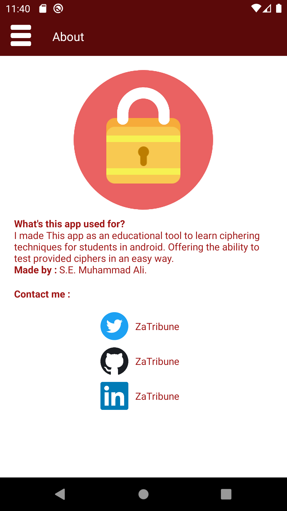
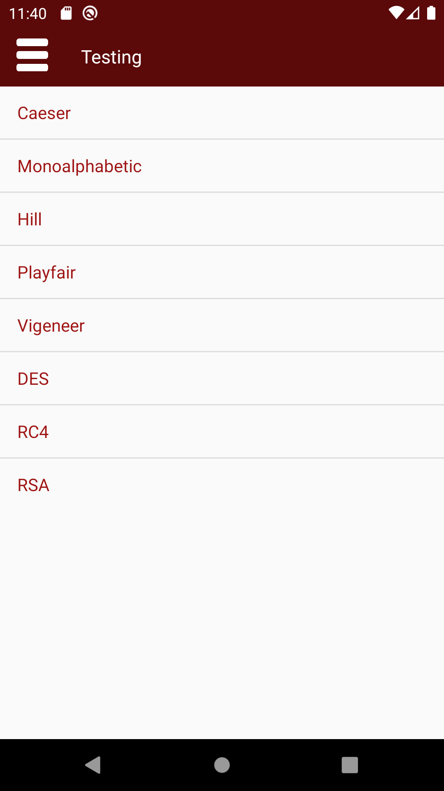
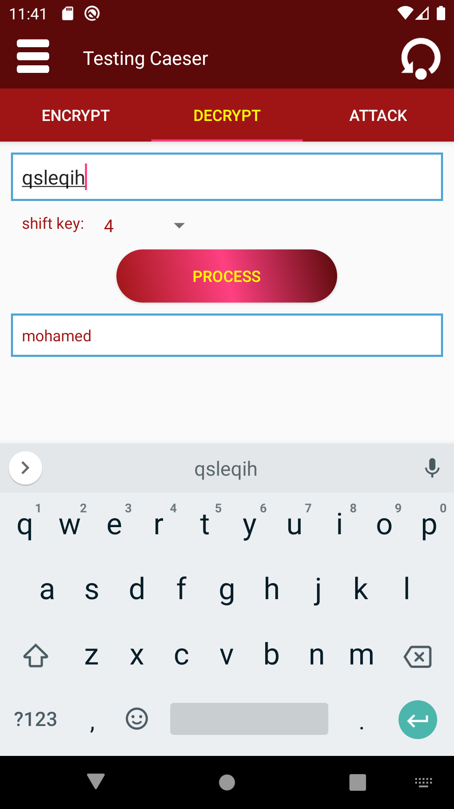
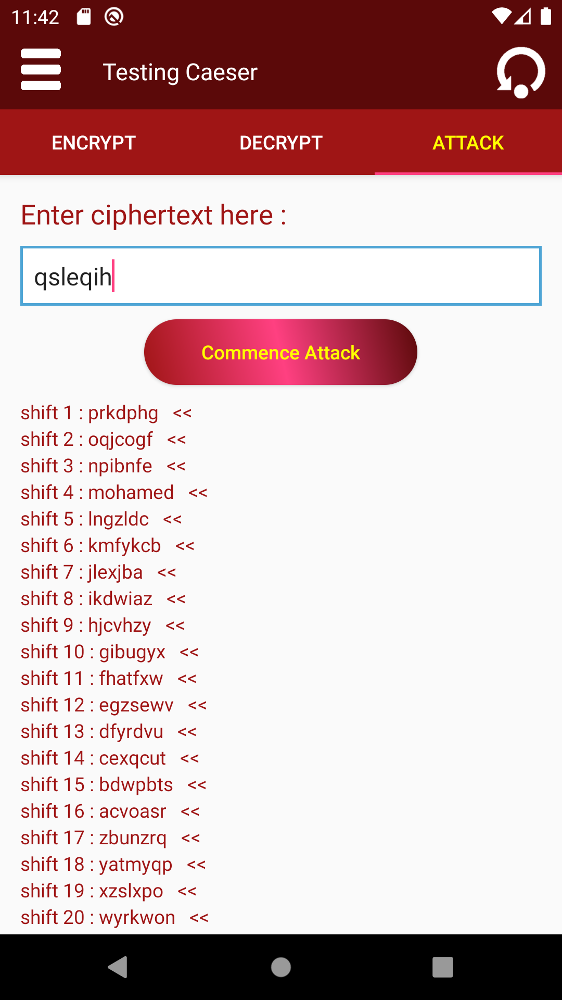

# Android : learn ciphering
A simple App for learning cryptography.

  
  
  
  

## Overview  
I made This app as an educational tool to learn ciphering techniques for students in android.

## Key Features
* Let's have fun and play with some of the most common Ciphering techniques.
* You can learn and read about the algorithms found within the App.
* Support for Android from API Level 16 .

## Android Support
 minSdkVersion 16
 
## Built With  
&nbsp;&nbsp;&nbsp;&nbsp;**Java** - The Main Programming Language and Framework.  
&nbsp;&nbsp;&nbsp;&nbsp;**Andoid SDK** - Software Platform for creating and delivering Android Applications.   
&nbsp;&nbsp;&nbsp;&nbsp;**Android Studio** - Java IDE.  
&nbsp;&nbsp;&nbsp;&nbsp;**Gradle** - Build tool & Dependency Management.    

## Authors  
   **Muhammad Ali Arafah** - find me on : [Twitter](https://twitter.com/ZaTribune), [LinkedIn](https://www.linkedin.com/in/zatribune).  
